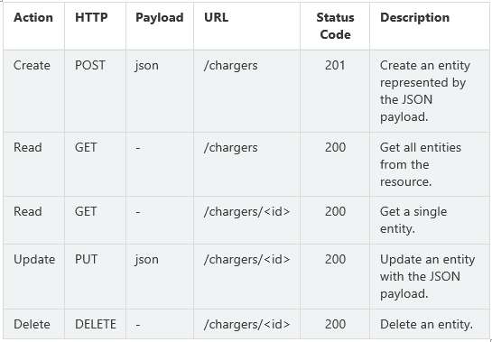
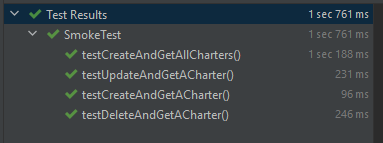

# CrudCrud REST api test

## Table of contents
* [Introduction](#introduction)
* [Test Scenario Category](#test-scenario-category)
* [Test Action](#test-action)
* [How to run test case](#how-to-run-test-case)
* [Built with](#built-with)
* [Directory tree structure](#directory-tree-structure)
* [Author](#author)

## Introduction
This project is a part of CRUD API REST demo. Please visit [test plan](https://github.com/Rebe001/CrudCrudUnitTestPostman) and [unit test](https://github.com/Rebe001/CrudCrudUnitTestPostman) for more details.

This maven project is to automate integration tests for the API Rest. API creation is supported by Crud Crud http://crudcrud.com, and resources `chargers` has been created.
Here are the list of APIs that will be tested in this project:


## Test Scenario Category

* Integration testing: Individuals API modules are grouped and tested as a group
* Basic positive testing: Create and Read all, Create and Read, Update and Read, Delete and Read

* This project won't consider negative cases but in the future it could be extended, some examples are:
- Negative testing: invalid payload type, invalid id, authorisation error, access error

## Test Action

* All test cases may be verified by these test actions. 
- Verify http status code
- Verify response payload is not null
- Verify field type and field value

## How to run test case
* modify endpoint identifier since it expired every 24 hours
* get and copy endpoint identifier from crudcrud.com
* go to `src/test/java/com/example/testingweb/SmokeTest.java` and to method `getRootUrl()`
* replace endpoint identifier `https://crudcrud.com/api/{endpoint identifier}/chargers/`
* `$ mvn clean`
* `$ mvn install` should automatically run Runner class `src/main/java/com/example/testingweb/TestWebApplication.java`
* Or `$ mvn test` 

Runner should automatically grab test file:
* runner class looks for `@Test` annotations to identify test file
* run tests under path `src/test/java/com/example/testingweb/SmokeTest.java`
* after build is run, display test result in terminal


Or you can run each testcases:
* go to each test case and click the run test button
   
## Built with
* Spring 
* Java 
* Maven

## Directory tree structure
```
+--src/
|  +--main/
|  |  +--java/
|  |  |  +--com/
|  |  |  |  +--example/
|  |  |  |  |  +--testingweb/
|  |  |  |  |  |  +--model/
|  |  |  |  |  |  |  +--Charger.java
|  |  |  |  |  |  +--TestingWebApplication.java
|  +--test/
|  |  +--java/
|  |  |  +--com/
|  |  |  |  +--example/
|  |  |  |  |  +--testingweb/
|  |  |  |  |  |  +--Helper.java
|  |  |  |  |  |  +--SmokeTest.java
``` 

* `model/Charger.java` for set Charger model
* `TestingWebApplication.java` Runner class, identity test cases with @Test annotation
* `Helper.java` for reusable utility
* `SmokeTest.java`to store test cases

## Author
* Contributor: Rebecca
* Date: 19/11/2021
